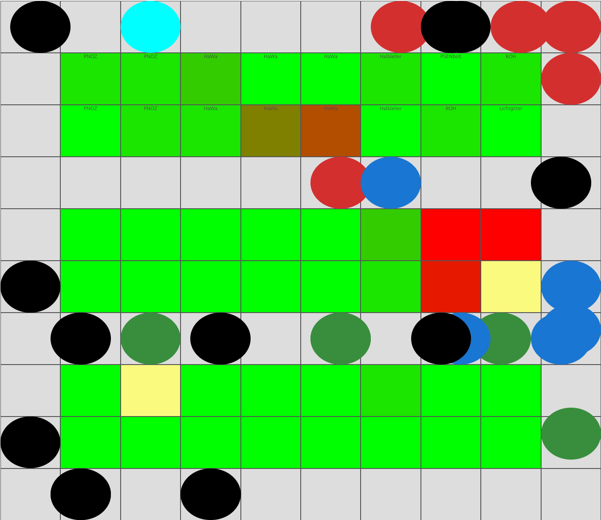

# 🏭 Warehouse Strategies Exemplified

A simulation of warehouse storage strategies — **Fixed Slotting**, **Chaotic Storage**, and **Hybrid Models** — implemented in a visual, browser-based environment.  
Built to explore optimization, overflow behavior, and real-time KPIs.

 <!-- Replace with actual GIF path -->

---

## 📦 Features

- 📊 Live KPI visualization (stock levels, pick times, shadow inventory)
- 🚧 Fixed / Chaotic / Hybrid zone simulation
- 🤖 Worker and picker agents with reservation systems
- 🎯 ABC classification and dynamic allocation strategies
- 🧠 Shadow stock & overflow detection logic
- 🖼️ Visual warehouse grid with interactive layout
- 🔁 Stress-test mode with animated failure detection

---

## ⚙️ Tech Stack

- **Frontend**: HTML5, CSS3, Vanilla JS  
- **Charts**: Chart.js  
- **Simulation Logic**: Custom JavaScript engine  

---

## 🖼️ Demo


You can create the GIF using [Peek](https://github.com/phw/peek) or `ffmpeg` on Linux:
```bash
peek                 # GUI to record screen
# OR
ffmpeg -video_size 1280x720 -framerate 30 -f x11grab -i :0.0 demo.mp4
